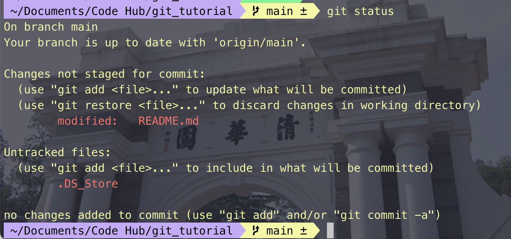
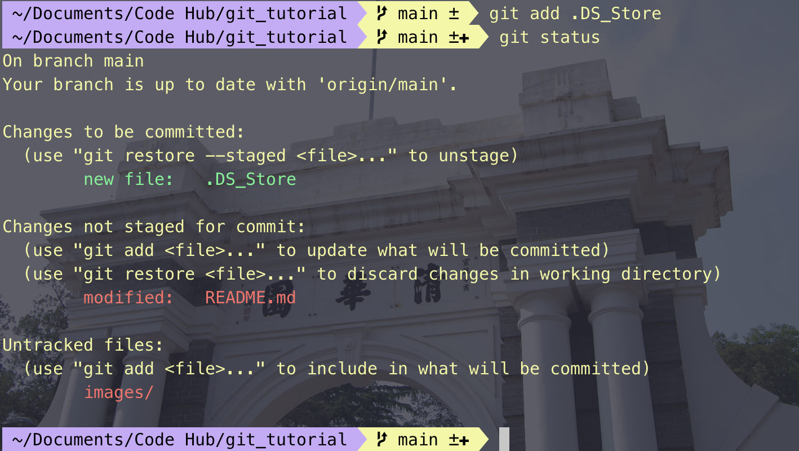
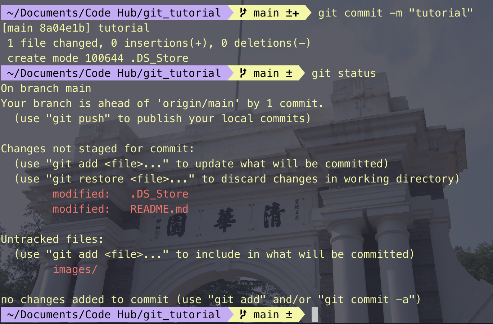
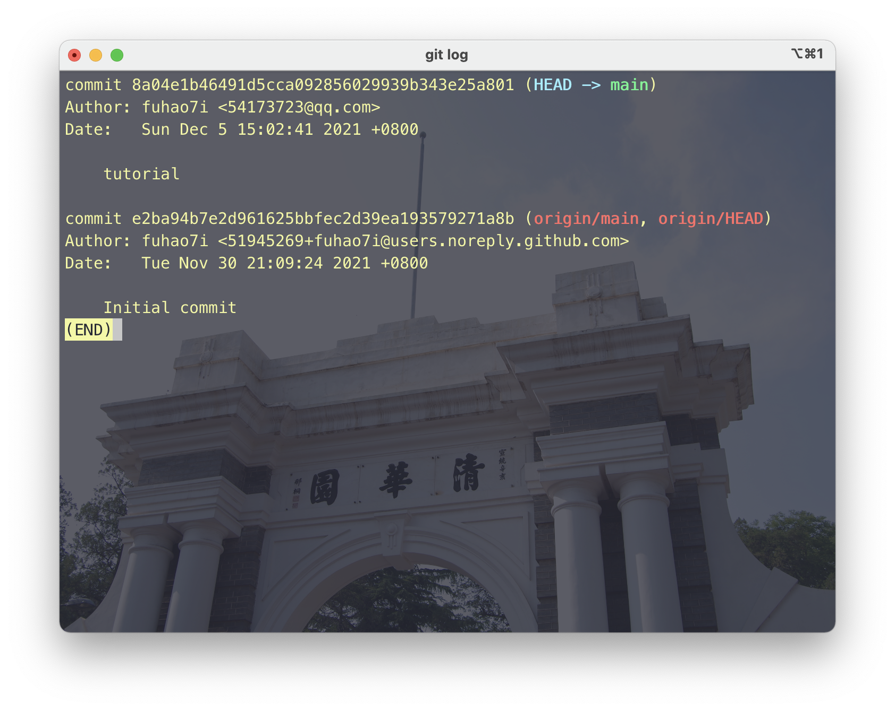

# git_tutorial
the tutorial for git

> Git是一个分布式版本管理系统，是为了更好地管理Linux内核开发而创立的。
>
> Git可以在任何时间点，把文档的状态作为更新记录保存起来。因此可以把编辑过的文档复原到以前的状态，也可以显示编辑前后的内容差异。
>
> 而且，编辑旧文件后，试图覆盖较新的文件的时候（即上传文件到服务器时），系统会发出警告，因此可以避免在无意中覆盖了他人的编辑内容。

**用Git管理文件的话，更新的历史记录会保存在Git，所以再也不需要备份文件啦，非常方便！**

## Git基础

### 1. 工作树和索引

在Git管理下，大家实际操作的目录成为工作树。在数据库和工作树之间有索引，索引是为了向数据库提交作准备的区域。（凭借中间索引，可以避免工作树中不必要的文件提交，还可以将文件修改内容的一部分加入索引区域并提交。）

### 2. 初期设定

1. 全局设定(只需设定一次)

```Bash
git config --global user.name "<username>"
git config --global user.email "<email>"
```

2. 也可以在某个具体的git仓库里进行局部设置

```Bash
git config user.name "<username>"
git config user.email "email"
```

### 3. 新建数据库

```Bash
git init
```

此时我们修改README.md文件，并用git status命令查看当前目录状态。
```Bash
git status
```



因为我这个仓库是通过克隆创建的，原仓库中本来就存在README.md文件，所以它已经被加入到了索引中，并能追踪到它的改变。而新文件.DS_Store并没有加入到索引中，所以它提示不能追踪.DS_Store文件的变更。

```Bash
# 将文件加入索引
git add <file> ...
```

也可以指定参数`git add .`就可以把所有的文件都加入到索引。

我们把.DS_Store加入到索引并确定一下。



文件加入到索引之后就可以进行提交了。

```Bash
git commit -m ""
```



使用log命令，就可以在数据库的提交记录上看到新的提交。



### 4. 共享数据库

> push到远程数据库
>> 为了将本地数据库的修改记录共享到远程数据库，必须上传本地数据库中存储的修改记录。为此，需要在Git执行推送(Push)操作。执行Push之后，本地的修改记录会被上传到远程数据库。所以远程数据库的修改记录就会和本地数据库的修改记录保持同步。

> 克隆远程数据库
>> 如果远程数据库中有他人的修改记录，那么把它完整地复制下来您就可以接着进行工作了。执行克隆后，远程数据库的全部内容都会被下载。之后您在另一台机器的本地数据库上进行操作。

> 从远程数据库pull
>> 若是共享的远程数据库由多人同时作业，那么作业完毕后所有人都要把修改推送到远程数据库。然后，自己的本地数据库也需要更新其他人推送的变更内容。
>> 进行拉取(Pull) 操作就可以把远程数据库的内容更新到本地数据库。进行拉取(Pull) 操作，就是从远程数据库下载最近的变更日志，并覆盖自己本地数据库的相关内容。

向远程数据库推送本地数据库的修改记录吧。

您可以给远程数据库取一个别名。这样，下次推送的时候就不需要输入长串的远程数据库地址了。在这个教程里，我们的远程数据库命名为“origin”。

请使用remote指令添加远程数据库。在<name>处输入远程数据库名称，在<url>处指定远程数据库的URL。

```Bash
git remote add <name> <url>

# git remote add origin https://[your_space_id].backlogtool.com/git/[your_project_key]/tutorial.git
```

使用push命令向数据库推送更改内容。<repository>处输入目标地址，<refspec>处指定推送的分支。我们将在高级篇详细地对分支进行说明。

```Bash
git push <repository> <refspec>...
```

使用clone指令可以复制数据库，在<repository>指定远程数据库的URL，
在<directory>指定新目录的名称。

```Bash
git clone <repository> <directory>
```

使用pull命令来拉取远程数据库。

```Bash
git pull <repository> <refspec>...

# git pull origin master
```

### 5. 合并修改记录

在执行pull之后，进行下一次push之前，如果其他人进行了推送内容到远程数据库的话，那么你的push将被拒绝。这种情况下，在读取别人push的变更并进行合并操作之前，你的push都将被拒绝。这是因为，如果不进行合并就试图覆盖已有的变更记录的话，其他人push的变更（图中的提交C）就会丢失。

为了把变更内容推送到远程数据库，我们必须手动解决冲突。首先请运行pull，以从远程数据库取得最新的变更记录吧。

讯息显示「Merge conflict in sample.txt」。请打开sample.txt文件，我们看到Git已添加标示以显示冲突部分。请为Git无法完成主动合并的部分做以下的修改。

## Git高级篇

在开发软件时，可能有多人同时为同一个软件开发功能或修复BUG，可能存在多个Release版本，并且需要对各个版本进行维护。

所幸，Git的分支功能可以支持同时进行多个功能的开发和版本管理。

### 1. 分支

分支是为了将修改记录的整体流程分叉保存。分叉后的分支不受其他分支的影响，所以在同一个数据库里可以同时进行多个修改。为了不受其他开发人员的影响，您可以在主分支上建立自己专用的分支。完成工作后，将自己分支上的修改合并到主分支。因为每一次提交的历史记录都会被保存，所以当发生问题时，定位和修改造成问题的提交就容易多了。

在Git您可以自由地建立分支。但是，要先确定运用规则才可以有效地利用分支。

这里我们会介绍两种分支 (“Merge分支”和 “Topic分支” ) 的运用规则。

#### 1.1. Merge分支

Merge分支是为了可以随时发布release而创建的分支，它还能作为Topic分支的源分支使用。保持分支稳定的状态是很重要的。如果要进行更改，通常先创建Topic分支，而针对该分支，可以使用Jenkins之类的CI工具进行自动化编译以及测试。

通常，大家会将master分支当作Merge分支使用

#### 1.2. Topic分支

Topic分支是为了开发新功能或修复Bug等任务而建立的分支。若要同时进行多个的任务，请创建多个的Topic分支。

Topic分支是从稳定的Merge分支创建的。完成作业后，要把Topic分支合并回Merge分支。

### 2. 分支的切换

若要切换作业的分支，就要进行checkout操作。进行checkout时，git会从工作树还原向目标分支提交的修改内容(就是把当前文件夹下的内容替换为切换到的分支的内容)。checkout之后的提交记录将被追加到目标分支。

#### 2.1 Head

HEAD指向的是现在使用中的分支的最后一次更新。通常默认指向master分支的最后一次更新。通过移动HEAD，就可以变更使用的分支。

提交时使用~(tilde)和^(caret)就可以指定某个提交的相对位置。最常用的就是相对于HEAD的位置。HEAD后面加上~(tilde）可以指定HEAD之前的提交记录。合并分支会有多个根节点，您可以用^(caret) 来指定使用哪个为根节点。

#### 2.2 Stash

还未提交的修改内容以及新添加的文件，留在索引区域或工作树的情况下切换到其他的分支时，修改内容会从原来的分支移动到目标分支。

但是如果在checkout的目标分支中相同的文件也有修改，checkout会失败的。这时要么先提交修改内容，要么用stash暂时保存修改内容后再checkout。

stash是临时保存文件修改内容的区域。stash可以暂时保存工作树和索引里还没提交的修改内容，您可以事后再取出暂存的修改，应用到原先的分支或其他的分支上。

### 3. 分支的合并

完成作业后的topic分支，最后要合并回merge分支。合并分支有2种方法：使用merge或rebase。使用这2种方法，合并后分支的历史记录会有很大的差别。

#### 3.1 merge

使用merge可以合并多个历史记录的流程。

#### 3.2 rebase

首先，rebase bugfix分支到master分支, bugfix分支的历史记录会添加在master分支的后面。如图所示，历史记录成一条线，相当整洁。

这时移动提交X和Y有可能会发生冲突，所以需要修改各自的提交时发生冲突的部分。

Merge和rebase都是合并历史记录，但是各自的特征不同。

merge
保持修改内容的历史记录，但是历史记录会很复杂。
rebase
历史记录简单，是在原有提交的基础上将差异内容反映进去。
因此，可能导致原本的提交内容无法正常运行。
您可以根据开发团队的需要分别使用merge和rebase。
例如，想简化历史记录，

在topic分支中更新merge分支的最新代码，请使用rebase。
向merge分支导入topic分支的话，先使用rebase，再使用merge。


1. 建立分支

```Bash
git branch <branchname>
```

不指定参数直接执行branch命令的话，可以显示分支列表。 前面有*的就是现在的分支。

```Bash
git branch
```

2. 切换分支

```Bash
git checkout <branch>
```

3. 合并分支

```Bash
git merge <commit>
```

该命令将指定分支导入到HEAD指定的分支。先切换master分支，然后把issue1分支导入到master分支。

4. 删除分支

```Bash
git branch -d <branchname>
```

5. 合并分支

在发生冲突的地方，Git生成了内容的差异。修改冲突的部分，重新提交。

rebase的时候，修改冲突后的提交不是使用commit命令，而是执行rebase命令指定 --continue选项。若要取消rebase，指定 --abort选项。

```Bash
git checkout issue3
    Switched to branch 'issue3'
git rebase master

git add myfile.txt
git rebase --continue
```

这样，在master分支的issue3分支就可以fast-forward合并了。切换到master分支后执行合并。

```Bash
$ git checkout master
Switched to branch 'master'
$ git merge issue3
Updating 8f7aa27..96a0ff0
Fast-forward
 myfile.txt |    1 +
 1 files changed, 1 insertions(+), 0 deletions(-)
```

### 4. 远端数据库

pull是拉取并进行合并操作，fetch只拉取，不合并。

### 5. 标签

标签是为了更方便地参考提交而给它标上易懂的名称。

Git可以使用2种标签：轻标签和注解标签。打上的标签是固定的，不能像分支那样可以移动位置。

1. 轻标签
添加名称
2. 注解标签
添加名称
添加注解
添加签名

一般情况下，发布标签是采用注解标签来添加注解或签名的。轻标签是为了在本地暂时使用或一次性使用。

您可以指定标签名称以退出.还可以简单的恢复过去特定的状态。

#### 5.1 添加轻标签

使用tag命令来添加标签，在<tagname>执行标签的名称。

```Bash
git tag <tagname>
```

在HEAD指向的提交里添加名为apple的标签，请执行以下的命令。

```Bash
git tag apple
```

如果没有使用参数而执行tag，可以显示标签列表。

```Bash
git tag
```

#### 5.2 添加注解标签

若要添加注解标签，可以在tag命令指定 -a选项执行。执行后会启动编辑区，请输入注解，也可以指定-m选项来添加注解。

```Bash
git tag -a <tagname>
```

如果在tag命令指定-n选项执行，可以显示标签的列表和注解

```Bash
$ git tag -n
apple           first commit
banana          连猴子都懂的Git
```

#### 5.3 删除标签

若要删除标签，在tag命令指定 -d选项执行。

```Bash
git tag -d <tagname>
```

### 6. 改写提交

#### 6.1 修改最近的提交

指定amend选项执行提交的话，可以修改同一个分支最近的提交内容和注解。

*主要使用的场合：*

1. 添加最近提交时漏掉的档案
2. 修改最近提交的注解

#### 6.2 取消过去的提交

在revert可以取消指定的提交内容。使用后面要提到的rebase -i或reset也可以删除提交。但是，不能随便删除已经发布的提交，这时需要通过revert创建要否定的提交。

*主要使用的场合：*

安全地取消过去发布的提交

#### 6.3 遗弃提交

#### 6.4 提取提交

在cherry-pick，您可以从其他分支复制指定的提交，然后导入到现在的分支。

*主要使用的场合：*

把弄错分支的提交移动到正确的地方
把其他分支的提交添加到现在的分支

#### 6.5 改写提交的历史记录

在rebase指定i选项，您可以改写、替换、删除或合并提交

*主要使用的场合：*

在push之前，重新输入正确的提交注解

清楚地汇合内容含义相同的提交。

添加最近提交时漏掉的档案

#### 6.6 具体实现

1. 改写提交

用log命令确认历史记录。

```Bash
$ git log
commit 326fc9f70d022afdd31b0072dbbae003783d77ed
Author: yourname <yourname@yourmail.com>
Date:   Mon Jul 16 23:17:56 2012 +0900

    添加add的说明

commit 48eec1ddf73a7fb508ef664efd6b3d873631742f
Author: yourname <yourname@yourmail.com>
Date:   Mon Jul 16 23:16:14 2012 +0900

    first commit
```

然后对sample.txt进行修改。添加 --amend 选项，然后提交。

```Bash
$ git add sample.txt
$ git commit --amend
```

编辑工具会显示最近一次提交的提交消息，把消息修改为「添加add和commit的讲解」并进行保存。

现在已经修改了提交的内容，然后用log命令确认历史记录和提交消息。

```Bash
$ git log
commit e9d75a02e62814541ee0410d9c1d1bf47ab1c057
Author: yourname <yourname@yourmail.com>
Date:   Mon Jul 16 23:17:56 2012 +0900

    添加add和commit的讲解

commit 48eec1ddf73a7fb508ef664efd6b3d873631742f
Author: yourname <yourname@yourmail.com>
Date:   Mon Jul 16 23:16:14 2012 +0900

    first commit
```

2. revert

3. reset

我们将用reset来删除master分支最前面的两个提交。

```Bash
git reset --hard HEAD~~
```

## Reference
[猴子都能懂的GIT入门](https://backlog.com/git-tutorial/cn/stepup/stepup7_7.html)